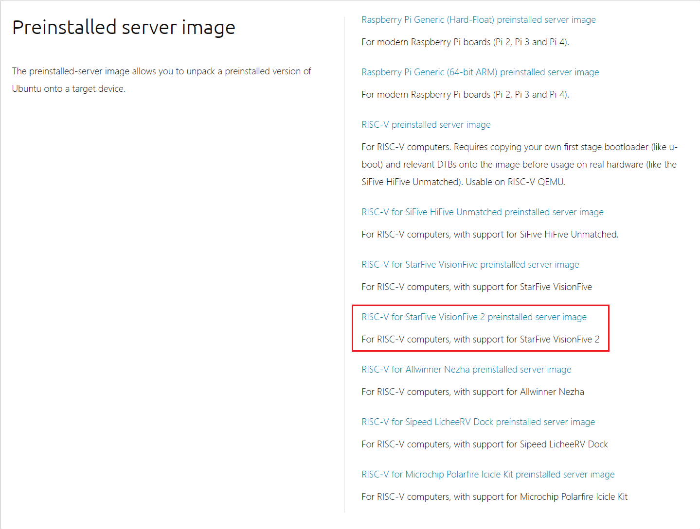
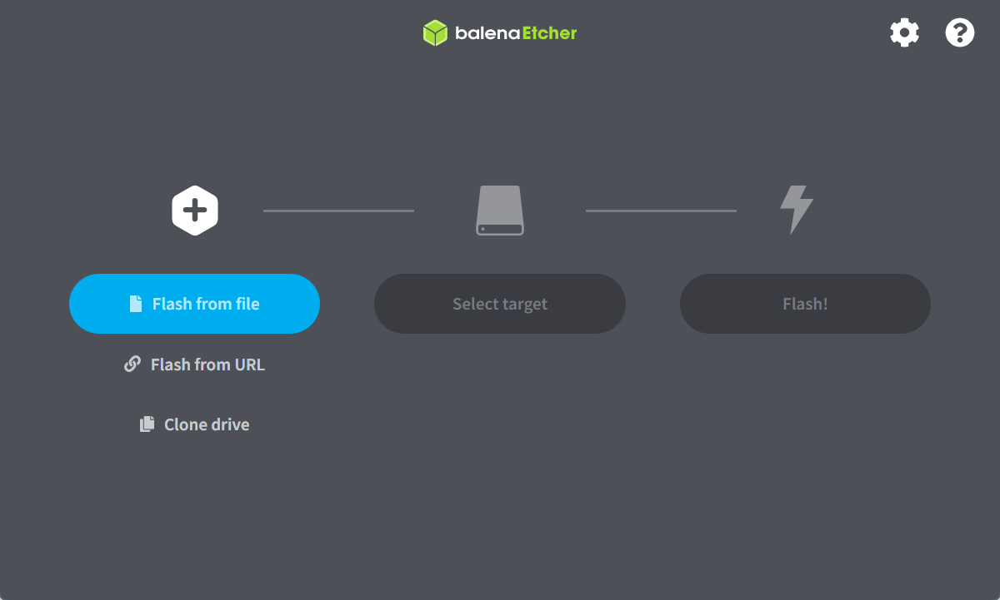

### 准备：
- SD卡（TF卡）
- 网线
- 路由器
- 接入路由器网络的一台电脑（下称`计算机`）

### 步骤：
- 下载[预安装映像](https://cdimage.ubuntu.com/releases/23.10/release/) （Preinstalled server image）：[For RISC-V computers, with support for StarFive VisionFive 2](https://cdimage.ubuntu.com/releases/23.10/release/ubuntu-23.10-preinstalled-server-riscv64+visionfive2.img.xz) 
	
- 使用[balenaEtcher - Flash OS images to SD cards & USB drives](https://etcher.balena.io/#download-etcher)将映像烧录到SD卡上
	
- SD卡插入开发板，上电开机。
- 网线一头连接VisionFive2 网口，另一头连接路由器。使用`计算机`登录路由器管理页面（通常是192.168.0.1），在路由器管理软件中找到新设备。（通常叫ubuntu），记录IP地址。
- 在计算机上SSH连接开发板。
```
	ssh ubuntu@192.168.0.7
```
	系统账号：ubuntu
	默认密码：ubuntu
连接成功后就可以用`计算机`使用开发板了。

### 可能遇到的问题：
- 烧录映像到SD卡中提示空间不足：排除真的空间不足的情况，检查文件系统是否为FAT，若是，改为NTFS。

