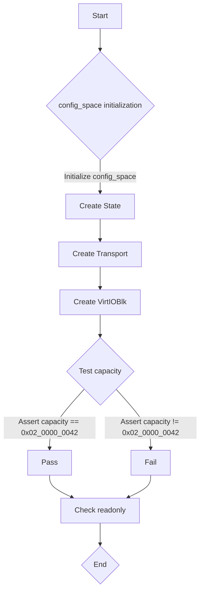
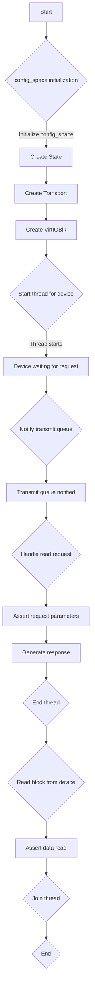
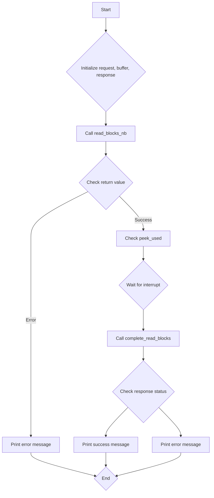

```mermaid
graph TD;
    A[Start] --> B{config_space initialization};
    B -->|Initialize config_space| C[Create State];
    C --> D[Create Transport];
    D --> E[Create VirtIOBlk];
    E --> F{Test capacity};
    F -->|Assert capacity == 0x02_0000_0042| G[Pass];
    F -->|Assert capacity != 0x02_0000_0042| H[Fail];
    G --> I[Check readonly];
    H --> I;
    I --> J{End};

```

```mermaid
graph TD;
    A[Start] --> B{config_space initialization};
    B -->|Initialize config_space| C[Create State];
    C --> D[Create Transport];
    D --> E[Create VirtIOBlk];
    E --> F{Start thread for device};
    F -->|Thread starts| G[Device waiting for request];
    G --> H{Notify transmit queue};
    H --> I[Transmit queue notified];
    I --> J{Handle read request};
    J --> K[Assert request parameters];
    K --> L[Generate response];
    L --> M{End thread};
    M --> N{Read block from device};
    N --> O[Assert data read];
    O --> P{Join thread};
    P --> Q{End};

```

```mermaid
graph TD;
    A[Start] --> B{Initialize request, buffer, response};
    B --> C[Call read_blocks_nb];
    C --> D{Check return value};
    D -->|Success| E[Check peek_used];
    E --> F{Wait for interrupt};
    F --> G[Call complete_read_blocks];
    G --> H{Check response status};
    H --> I[Print success message];
    H --> J[Print error message];
    D -->|Error| K[Print error message];
    K --> L{End};
    I --> L{End};
    J --> L{End};

```

